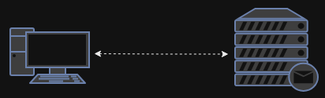
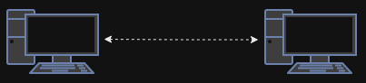
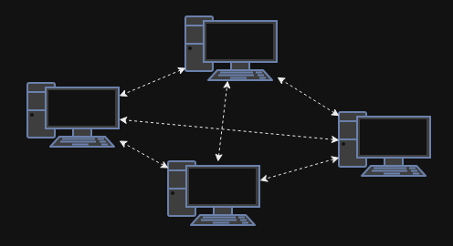
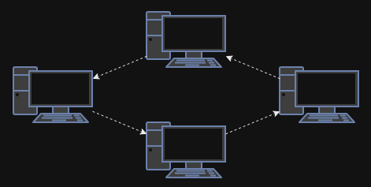
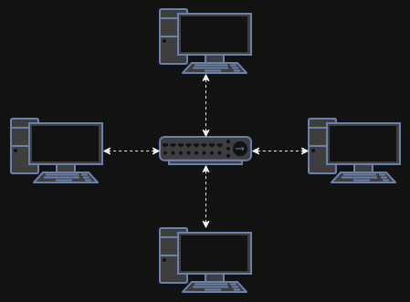

<!-- _paginate: false -->
<!-- _header: "" -->
<!-- _footer: "Ce cours a été rédigé par [Argann BONNEAU](https://argann.me) et est sous license [CC BY-SA 4.0](https://creativecommons.org/licenses/by-sa/4.0/?ref=chooser-v1)" -->

# Réseau - Introduction

---

## 1. Un réseau, c'est quoi ?

---

Un **réseau** à pour but de **connecter** des ordinateurs entre eux afin qu'ils puissent **partager leurs ressources**.

---

Par exemple : quand vous consultez vos mails, votre ordinateur va utiliser le réseau sur lequel il est connecté pour échanger des informations avec le serveur qui gère vos mails.

---

Un réseau peut être composé de pleins d'équipements très différents (ordinateurs, serveurs, _hubs_, _switchs_, _routers_, ...), reliés ensemble par pleins de méthodes (ethernet, usb, wifi, fibre optique, ...).

Nous verrons tout ça tout au long du module !

---

On catégorise généralement un réseau en fonction de sa taille géographique.

Un réseau défini dans une zone limitée (une maison, une salle, un bâtiment), est appelé **LAN**, pour _Local Area Network_.

---

Au contraire, un réseau défini sur une zone géographique plus grande (ville, pays, planète), est appelé **WAN**, pour _Wide Area Network_.

---

Il existe d'autres appellations pour des tailles de réseaux intermédiaires :

- **Enterprise Network** pour un réseau d'entreprise s'étendant sur plusieurs sites
- **Personnal Area Network** pour un tout petit réseau composé uniquement de dispositifs personnels connectés entre eux (casque connecté en bluetooth à un téléphone, par ex.).
- ...

---

L'ensemble de tous les réseaux informatiques forment ce que l'on appelle "**Internet**".

---

## 2. Topologies

---

Un réseau est composé de deux choses :

- Un **protocole** : la façon dont les équipements échangent des informations
- Une **topologie** : l'architecture utilisée pour reliés les équipements entre eux

---

Pour cette section, oublions la partie "protocole" : nos équipements sont reliés par des "tubes" dans lesquels ils ne savent que balancer leurs données.

---

Topologie 1 : **Point à point**

On n'a que deux PC, on les relie ensemble !

Très simple, mais on fait comment quand on a plus de deux PC à relier ?

---

Topologie 2 : **Réseau maillé**

On relie tout le monde ensemble !

OK, mais c'est coûteux : imaginez le nombre de cables pour un réseau de 30 postes !

---

Topologie 3 : **Anneau**

Tout le monde est connecté en cercle : si tu reçois une info qui n'est pas pour toi, tu la passes à ton voisin.

Moins coûteux, mais si un poste plante, le réseau ne fonctionne plus.

---

Comment connecter tout le monde ensemble, sans avoir à poser un cable entre chaque paire de PC ?

Il faudrait une sorte de "multi-prise", sur laquelle tout le monde viendrait se brancher...

---

**Nouvel équipement débloqué !**

Le **hub** est un équipement réseau ayant pleins de ports.

A chaque fois qu'il reçoit une donnée sur un port, il l'a renvoie sur tous les autres ports ! => _Broadcasting_

---

Topologie 4 : **Étoile**

Tout le monde est connecté à un hub central.

Moins de câble, plus facile à gérer.

_On peut remplacer le hub par un switch ou un routeur, mais on verra ça plus tard._

---

Dans les _LAN_ modernes, la topologie en étoile est la plus répandue.

Prenez votre appartement. Votre PC, votre téléphone, votre TV, tout est connecté directement à votre box internet : c'est une topologie en étoile.
