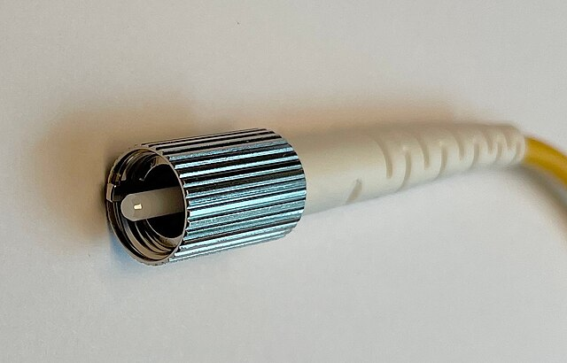
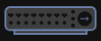
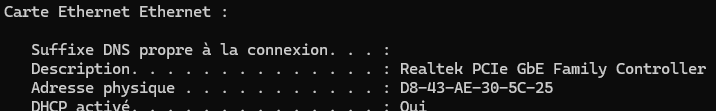
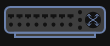
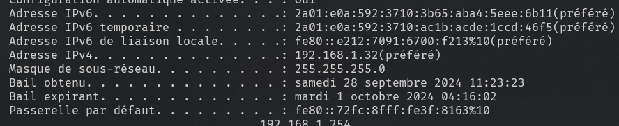
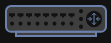

<!-- _paginate: false -->
<!-- _header: "" -->
<!-- _footer: "Ce cours a été rédigé par [Argann BONNEAU](https://argann.me) et est sous license [CC BY-SA 4.0](https://creativecommons.org/licenses/by-sa/4.0/?ref=chooser-v1)" -->

# Réseau - Couches OSI

---

## 1. OSI ?

---

Il existe _beaucoup_ de manières de faire communiquer des ordinateurs entre eux.

Beaucoup de manières de les connecter, beaucoup de logiciels, de protocoles, ...

---

En 1984, l'Organisation Internationale de Standardisation (ISO), propose un standard de fonctionnement pour représenter n'importe quel type de réseau.

Le but : permettre à des réseaux très différents de pouvoir se connecter.

---

Ce standard, appelé "Modèle OSI" (_Open Systems Interconnection_), décrit **7 couches**.

Chacune rajoute un niveau d'abstraction supplémentaire par rapport à la couche inférieure.

---

| N° | Nom |
| --- | --- |
| 7 | Application |
| 6 | Présentation |
| 5 | Session |
| 4 | Transport |
| 3 | Réseau |
| 2 | Liaison |
| 1 | Physique |

---

## Couche 1 - Physique

---

La première couche (Physique) détermine le support physique, matériel, mécanique et/ou électrique soutenant le réseau.

---

Quelques exemples :

- Paire torsadée
- Fibre optique
- Ondes radio
- Interface réseau
- ...

---

Un **hub** est un dispositif réseau de couche 1, car il ne fait rien d'autre que de retransmettre ce qu'il reçoit sur un de ses ports sur tous les autres ports, sans autre logique.

---

**Un problème dans cette couche ?**

Vérifiez que les câbles soient bien branchés et ne sont pas défectueux.

Vérifiez que le récepteur n'est pas trop loin de l'émetteur, et qu'il n'y a pas d'interférences.

---

**Limites**

Bon, OK, on branche des trucs ensembles, c'est un peu limité.

Il nous faut maintenant trouver un moyen de représenter des données, pour pouvoir les envoyer sur ce support physique...

---

## Couche 2 - Liaison

---

La seconde couche (Liaison) gère la communication entre des ordinateurs ayant une liaison directe.

L'implémentation la plus utilisée aujourd'hui est **Ethernet**.

---

Cette couche apporte la notion d'**adresse MAC** : une adresse **unique** que _tous_ les dispositifs pouvant se connecter à un réseau possèdent.

--- 

Sur Windows, vous pouvez voir les adresses MAC de toutes les cartes réseau de votre pc avec la commande `ipconfig /all` : 

---

Avec Ethernet, toutes les données sont structurées en **trames** de quelques octets.

Chaque trame possède, entre autres :

- La donnée à transmettre
- L'adresse MAC de destination
- L'adresse MAC source

[Pour en savoir plus !](https://en.wikipedia.org/wiki/Ethernet_frame)

---

Un **switch** est un dispositif de couche 2.

Contrairement au **hub**, le switch connaît l'adresse MAC de chaque dispositif connecté à ses ports.

Quand il reçoit une trame Ethernet, il sait donc vers quel port la transmettre.

---

**Un problème dans cette couche ?**

Si vous avez modifié l'adresse MAC d'un périphérique, vérifiez qu'aucun autre périphérique du réseau ne possède la même.

_Normalement, vous ne devriez **pas** toucher aux adresses MAC manuellement_.

---

**Limites**

Une adresse MAC n'a aucune notion de "réseau" : c'est juste un identifiant unique.

Au sein d'un réseau local, c'est suffisant.

Mais pour atteindre des ordinateurs situés dans d'autres réseaux, il va nous falloir autre chose...

---

## Couche 3 - Réseau

---

La troisième couche (Réseau) ajoute la possibilité de transmettre des données à travers plusieurs réseaux.

L'implémentation la plus courante de cette couche est **Internet Protocol**, ou _**IP**_.

---

Cette couche apporte la notion d'**adresse IP** : une adresse contenant à la fois l'adresse du réseau dans lequel se trouve l'ordinateur, et l'identifiant unique de cet ordinateur au sein de ce réseau.

(On verra un peu plus tard comment ça fonctionne)

--- 

`ipconfig /all` permet de voir l'adresse IP de chaque carte réseau de votre ordinateur.

---

Avec **IP**, toutes les données sont structurées sous forme de **paquets**.

Leur structure est un peu plus complexe que les _trames Ethernet_, mais ont un fonctionnement similaire sur quelques points.

---

Un **routeur** est un dispositif de couche 3.

Son rôle est de servir de "pont" entre plusieurs réseaux, en décrivant des _routes IP_.

Votre box internet, chez vous, est une sorte de routeur, reliant votre réseau domestique au réseau de votre fournisseur.

---

## Autres couches

---

Les couches supérieures du modèle OSI sont plus haut niveaux, et nous intéressent _un peu_ moins pour le moment.

Voyons les rapidement !

---

**Couche 4 : Transport**

Regroupe les protocoles permettant la communication entre deux processus situés chacun sur un ordinateur distant.

Exemple : TCP, UDP

---

**Couche 5 : Session**

Ajoute la gestion de connexion pouvant rester ouverte un certain temps ("sessions") entre plusieurs périphériques.

Pas vraiment d'implémentation spécifique avec la pile TCP/IP.

---

**Couche 6 : Présentation**

Les couches inférieures ne manipulent que des données binaires : cette couche ajoute la possibilité de manipuler des données complexes (en les représentant ensuite en binaire).

Exemple : JPEG, ASCII, ...

---

**Couche 7 : Application**

Couche la plus haute, on parle ici des protocoles utilisés directement par des applications ayant besoin d'une connexion.

Exemple : HTTP, FTP, SMTP, ...

---

## Encapsulation / Désencapsulation

---

Imaginons comment se forme la communication sur un réseau pour charger une page web !

Dans les slides suivantes, on va imaginer que vous utilisez Firefox pour ouvrir une page web.

---

**Couche 7 : Application**

Pour demander l'affichage d'une page web, firefox va utiliser le protocole HTTP, qui est de couche 7.

Une requête HTTP est un texte contenant tous les paramètres de la requête, dont l'URL du site à afficher.

---

**Couche 6 : Présentation**

Le protocole HTTP (toujours lui) se charge de transformer en binaire la requête HTTP à l'origine sous forme de texte.

---

**Couche 4 : Transport**

(La couche 5 est skippée ici pour faire plus simple)

La requête binaire HTTP est ensuite donnée au protocole TCP, qui va la séparer en plusieurs segments.

TCP permet entre autres de s'assurer que ces segments arrivent à bon port.

---

**Couche 3 : Réseau**

La couche IP va ensuite découper ces segments en paquets IP, en leur donnant la route IP à suivre pour atteindre le serveur web.

---

**Couche 2 : Liaison**

La couche Ethernet va (encore !) découper les paquets IP pour former des trames Ethernet, prêtes à être envoyer à la couche physique.

---

**Couche 1 : Physique**

Les paquets sont envoyés via la connexion filaire, wifi, ou autre !

---

Côté serveur, **le processus inverse aura lieu au moment de la réception !**

Il utilisera sa couche 2 pour assembler les trames Ethernet reçues en paquets IP à envoyer à la couche 3, qui les assemblera encore pour former les segments TCP traitées ensuite par la couche 4, etc, etc.

