<!-- _paginate: false -->
<!-- _header: "" -->
<!-- _footer: "Ce cours a été rédigé par [Argann BONNEAU](https://argann.me) et est sous license [CC BY-SA 4.0](https://creativecommons.org/licenses/by-sa/4.0/?ref=chooser-v1)" -->

# Configuration IP

---

## Préparation

---

La plupart du temps, une interface réseau peut avoir deux types de configuration IP :

- **Automatique** (via DHCP)
- **Manuelle** 

---

Dans le cas de la configuration automatique, vous n'avez généralement rien besoin de faire (à part vous assurer qu'un serveur DHCP fonctionnel soit disponible sur le réseau).

---

Pour la configuration manuelle, vous devrez toujours spécifier les informations suivantes :

- L'**Adresse IPv4**
- Le **Masque de sous-réseau**
- La **Passerelle par défaut**

---

Attention, si vous spécifiez une adresse manuellement, assurez-vous de ne pas donner une adresse existant déjà sur le réseau !

---

## Windows - UI

---

Sous Windows, il est possible de modifier sa configuration IP via les paramètres.

Les fenêtres peuvent différer en fonction de la version de Windows utilisée.

---

La méthode commune (et encore utilisable sous Windows 11), est de passer par le **Centre Réseau et partage**.

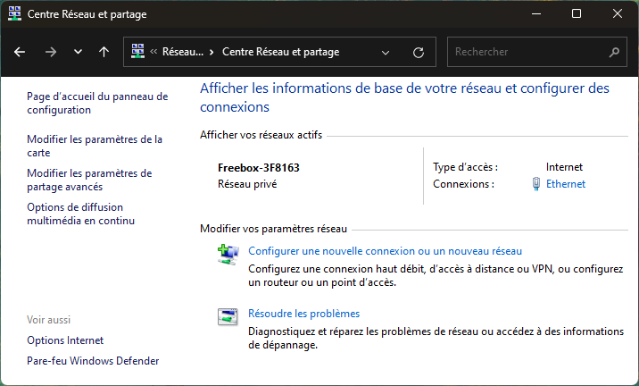

---

Cliquez sur le lien situé après "Connexions : "

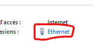

---

Cliquez ensuite sur "Propriétés" :

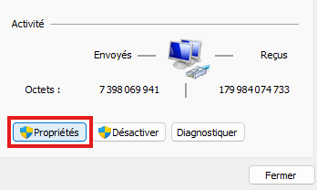

---

Une carte réseau peut être utilisée par plusieurs protocoles et services.

Pour modifier la configuration IPv4, double-cliquez sur "Protocole Internet version 4 (TCP/IPv4) :

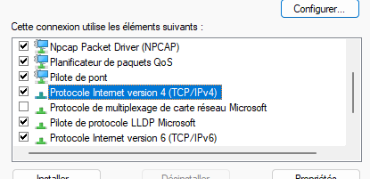

---

Vous pourrez ensuite modifier la configuration IP dans la nouvelle fenêtre.

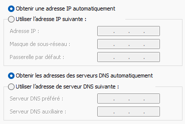

---

## Windows - cmd.exe

---

Dans `cmd.exe`, ouvert en tant qu'administrateur, récupérez le nom de votre interface réseau à modifier :

`netsh interface ipv4 show config`

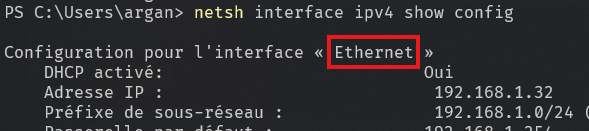

---

Tapez ensuite la commande suivante pour une configuration manuelle.

Remplacez bien les mots en MAJUSCULE par les informations correspondantes.

`netsh interface ipv4 set address name="NOM INTERFACE" static ADRESSE_IP MASQUE PASSERELLE`

---

Exemple :

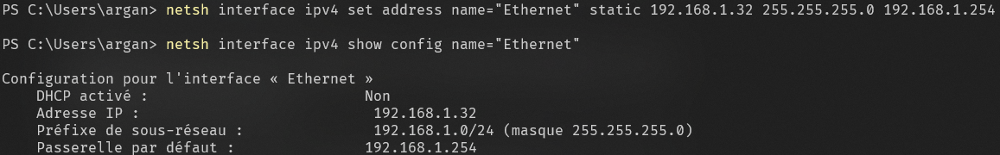

---

Pour passer en configuration automatique, tapez la commande suivante :

`netsh interface ipv4 set address name="NOM INTERFACE" source=dhcp`

---

Si vous ne récupérez pas tout de suite une adresse IP du serveur DHCP, vous pouvez en demandez une en tapant `ipconfig /renew`

---

## Linux

---

La configuration IP sous Linux dépend du système sur lequel vous êtes.

En effet, certaines distributions peuvent inclure des outils de gestion du réseau différents, à vous de connaître votre système !

---

Ici, on va partir du principe que nous sommes sur un système Debian **sans environnement graphique**.

---

**Attention !**

Toute _modification_ de la configuration réseau demande d'avoir les droits administrateurs !

---

Pour afficher la configuration IP, nous avons la commande `ip address` (ou `ip a`)

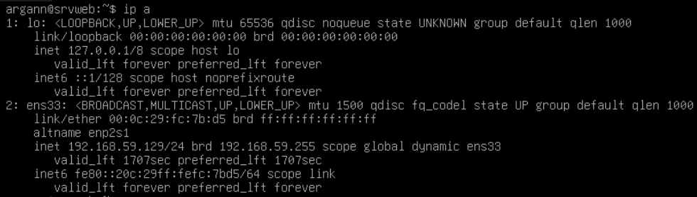

---

Notez bien le nom de l'interface réseau que vous voulez modifier.

La plupart du temps, elle va avoir un nom en `ensXX`, mais ce n'est pas toujours le cas.

L'interface `lo` est votre interface de loopback, n'y touchez pas !

---

La commande `ip` peut permettre de modifier la configuration IP, mais **uniquement de manière temporaire** (tout est reset au reboot).

---

Pour modifier durablement cette configuration, vous devez modifier le fichier `/etc/network/interfaces`.

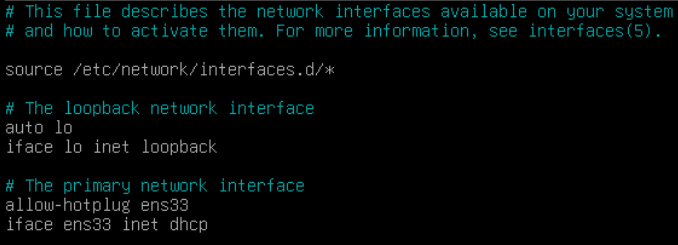

---

Trouvez les lignes correspondantes à votre interface.

Par défaut, elle devrait être configurée en mode "automatique" (`dhcp`)

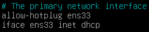

---

Pour passer la configuration en manuel, ajoutez les lignes suivantes.

Attention, remplacez les adresses et le masque (qui sont ici des exemples) par votre configuration !

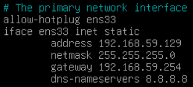

---

Pour que tout soit pris en compte, redémarrez le service réseau :

`systemctl restart networking`