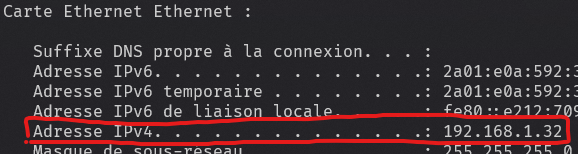

<!-- _paginate: false -->
<!-- _header: "" -->
<!-- _footer: "Ce cours a été rédigé par [Argann BONNEAU](https://argann.me) et est sous license [CC BY-SA 4.0](https://creativecommons.org/licenses/by-sa/4.0/?ref=chooser-v1)" -->

# Réseau - IPv4

---

## C'est quoi ?

---

Imaginez un campus sur lequel se trouve plusieurs bâtiments avec un identifiant unique (A, B, C, D, ...).

Chaque bâtiment possède un certain nombre de salles numérotées (101, 204, 404, ...).

Les salles au sein d'un même bâtiment ont toutes un numéro différent, mais il peut exister deux salles ayant le même numéro si elles sont dans des bâtiments différents.

---

Si on vous donne rendez-vous dans une salle précise, il faut _obligatoirement_ vous donner le numéro du bâtiment, ainsi que le numéro de la salle dans ce bâtiment. Par exemple : B102, D401, etc.

Si une de ces deux informations vous manque, vous risquez de vous perdre...

---

Une adresse **IPv4**, c'est la même chose, mais pour identifier un ordinateur au sein d'un réseau !

C'est une fonctionnalité ajoutée par le protocole de couche 3 "**IP**".

---

## Comment ça marche ?

---

Une adresse IPv4 est composée de 4 nombres entiers non signés, chacun codés sur un octet.

Par exemple, pour `127.0.0.1` :

$01111111\space00000000\space00000000\space00000001$

---

Comme pour nos identifiants de salle de tout à l'heure (C201, A304, etc.), notre adresse IPv4 est en réalité constitué de deux éléments : 

- l'adresse du réseau, sur les $x$ premiers bits
- l'identifiant de la machine, sur les bits restants

---

Mais comment retrouve-t-on l'adresse du réseau à partir d'une adresse IPv4 ?

`192.168.5.24`

Est-ce que c'est `192.0.0.0` ?
Ou `192.168.5.0`?

Impossible de savoir comme ça !

---

**Première option : Notation CIDR**

Le nombre de bits correspondant à l'adresse du réseau est noté après un `/` à la fin de l'IPv4 :

`192.168.5.24/16`

Le réseau est donc en `192.168.0.0`.
L'identifiant machine est donc `0.0.5.24`

---

**Seconde option : Masque de sous-réseau**

On crée un nombre sur 32 bits (miroir de notre IPv4) où on met tous les bits correspondant au réseau à 1, et tous les autres à 0.

$11111111\space11111111\space00000000\space00000000$
(En décimal : 255.255.0.0)

---

Pour récupérer l'adresse du réseau, il suffit de faire $\text{Mon IPv4}\space\&\space\text{Masque}$

$$
\begin{align}
11000000\space10101000\space00000101\space00011000& \\
\underline{\&\quad 11111111\space11111111\space00000000\space00000000}& \\
11000000\space10101000\space00000000\space00000000
\end{align}
$$

(En décimal : 192.168.0.0)

---

## Limites

---

Une adresse IPv4 n'est codée que sur 32 bits.

Au grand maximum, il n'y a donc que 4.294.967.296 adresses disponibles.

---

Dans les années 80, c'était une limite correcte.

Depuis 15 ans, l'explosion des dispositifs connectés a fait voler en éclat cette limite.

---

Différentes technologies permettent aujourd'hui de continuer d'utiliser IPv4 malgré le nombre de dispositifs :

- Sous-réseaux (CIDR, contrairement aux "classes IP")
- Interfaces avec adresse, mais sans réseau (pour du point à point)
- NAT (permet l'utilisation de réseaux privés, entre autres)

---

Mais sur le long terme, une autre solution doit être envisagée...

(Suite au prochain cours !)