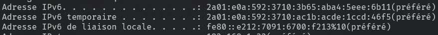

<!-- _paginate: false -->
<!-- _header: "" -->
<!-- _footer: "Ce cours a été rédigé par [Argann BONNEAU](https://argann.me) et est sous license [CC BY-SA 4.0](https://creativecommons.org/licenses/by-sa/4.0/?ref=chooser-v1)" -->

# Réseau - IPv6

---

## Rappels

---

En 1981, la version 4 du protocole de couche 3 "IP" est créée.

Son rôle : créer un système d'adressage pour tous les périphériques voulant se connecter à un réseau informatique.

---

Une adresse IPv4 est alors décrite sur 32 bits, soit 4 octets.

Nombre d'adresses théoriques possibles en IPv4 :

**4 294 967 296**

---

Très vite, on se rend compte qu'il n'y aura pas assez d'adresses pour tout le monde.

Des améliorations sont mises en places (CIDR, NAT, etc.), mais ne corrigent pas le problème fondamental : il faut plus d'adresses.

---

En 1998, une nouvelle version du protocole IP, **IPv6**, propose un système d'adressage sur **128 bits**, soit **16 octets**.

Nombre d'adresses théoriques possibles en IPv6 :

**340 282 366 920 938 463 463 374 607 431 768 211 456**

---

Pour épuiser toutes les adresses IPv6, il faudrait placer **2.30 milliards de milliards d'appareils connectés sur chaque millimètre carré de surface terrestre émergée**.

(on est laaaaarge)

---

_Ah, du coup une IPv6, c'est exactement comme une IPv4 mais sur plus de bits ?_

**Non**.

Reprenons depuis le début...

---

## A quoi ça ressemble ?

---

Une IPv4 (4 octets) est représentée en traduisant chaque octet en nombre décimal, qu'on sépare par des points `.` :

`192.168.0.1`

---

Une IPv6 contient **16** octets. 

Si on reprend la même méthode qu'IPv4, ça pourrait donner quelque chose comme ça :

(on utilise `:` comme séparateur en v6)

`32:1:13:184:0:0:133:163:0:0:0:0:172:31:128:1`

(pas ouf)

---

Pour simplifier les choses, on n'utilise pas des nombres décimaux, mais **hexadécimaux** (base 16). En plus, on va regrouper les octets par paires :

`2001:0db8:0000:85a3:0000:0000:ac1f:8001`

(un peu mieux ?)

---

Quand on compte en base 10, on n'écrit pas "0002 pizzas", mais "2 pizzas" : les 0 devant un nombre sont inutiles.

Pareil en IPv6 : on peut enlever chaque 0 en trop dans chaque groupe.

`2001:db8:0:85a3:0:0:ac1f:8001`

---

Enfin, on peut remplacer la plus grande suite de groupes valant 0 par les symboles `::`.

Attention, on ne peut le faire qu'une fois dans une adresse !

`2001:db8:0:85a3::ac1f:8001`

---

## Structure d'une adresse IPv6

---

La structure d'une adresse IPv6 est plus simple que celle d'une IPv4.

- 64 premiers bits : "Préfixe" (adresse) du réseau
- 64 derniers bits : "Identifiant" de la machine

---

Le préfixe peut être découpé en sous-réseaux comme en IPv4, la notation CIDR est donc toujours utile !

Pour `2001:db8::/32`, les 32 premiers bits du préfixe sont fixes, les 32 suivants peuvent être utilisés pour créer des sous-réseaux.

---

Une seule carte réseau possède généralement **plusieurs adresses IPv6**.

---

Pourquoi ?

**Parce qu'il existe plusieurs types d'adresses IPv6**.

Chaque type à son utilité !

---

L'adresse **unicast de liaison locale** est une adresse unique _au sein du réseau local_.

Son préfixe est `fe80::/10`

(Pensez à `192.168.0.1` en IPv4)

---

L'adresse **unicast globale** est une adresse unique _dans le monde entier_.

Son préfixe est `2000::/3`

Ce réseau est géré par l'IANA, qui donne des sous-réseaux à des organismes régionaux, qui eux-mêmes donnent des sous-réseaux aux FAI, qui ensuite donnent des sous-réseaux aux clients.

---

L'adresse temporaire est une adresse **unicast globale** classique qui change régulièrement, et qui permet de ne pas dévoiler son adresse IPv6 à l'ensemble d'internet.

---

Mais il existe aussi des adresses **multicast**, et tout un tas de portées et de types utiles pour des cas... plus poussés.

---

Pour la partie "Identifiant", y'a plusieurs façons de faire.

- Au pif (Windows le fait pour certaines adresses)
- Calcul à partir de l'adresse MAC (pas super sécurisé)
- Calcul à partir d'une clé privée (mieux)