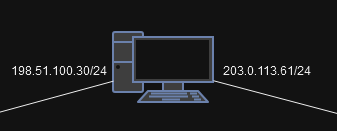
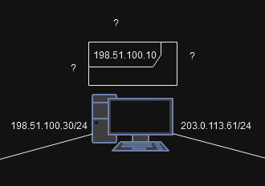
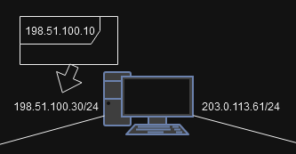
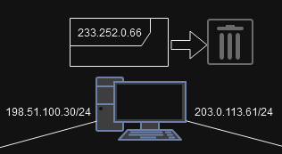
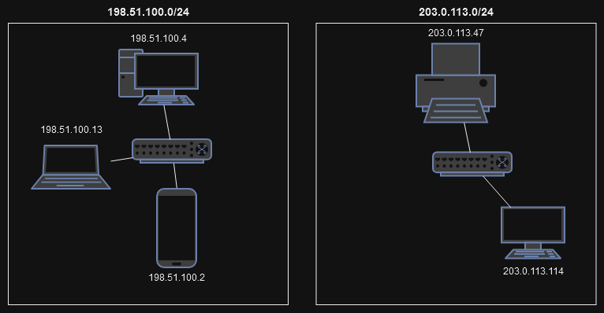
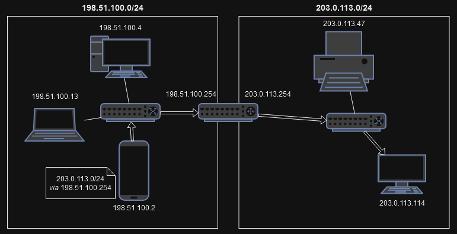
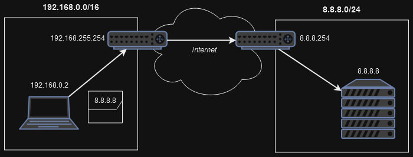
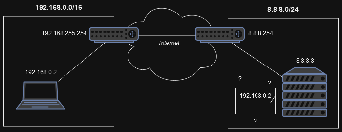

<!-- _paginate: false -->
<!-- _header: "" -->
<!-- _footer: "Ce cours a été rédigé par [Argann BONNEAU](https://argann.me) et est sous license [CC BY-SA 4.0](https://creativecommons.org/licenses/by-sa/4.0/?ref=chooser-v1)" -->

# Routes IP

---

## Interfaces

---

Imaginons un PC ayant deux cartes réseaux, et étant ainsi connecté à deux réseaux distincts.

---

Ce PC souhaite envoyer un paquet à une adresse IP spécifique. Sur quelle interface doit-il l'envoyer ?

On ne veut pas surcharger le réseau !

---

Si une des interfaces est sur le même réseau que la destination du paquet, on l'envoie dessus !

---

Par contre, si la destination ne correspond au réseau d'aucune interface, par défaut, on va tout simplement le supprimer, sans l'envoyer.

---

Si on se limite à ça, il serait impossible de communiquer avec des réseaux distants, donc _internet_ n'existerait pas.

Il faudrait un truc en plus...

---

## Routage

---

Imaginez que nous ayons ces deux réseaux distincts :

---

Au sein de chaque réseau, un _switch_ (couche 2) relie tous les équipements.

Le smartphone ayant l'IP `198.51.100.2` peut donc communiquer avec le PC en `198.51.100.4`.

---

Néanmoins, les deux réseaux ne sont pas interconnectés : rien ne les relie !

Le PC portable du réseau de gauche ne peut donc pas utiliser l'imprimante du réseau de droite.

**Comment relier tout ça ?**

---

On ne peut pas utiliser de _hub_ ou de _switch_ : ils ne savent pas ce que sont des adresses IP, et sont donc incapables de différencier les deux réseaux.

---

Un **routeur** peut avoir, lui, une IP pour chaque réseau sur lequel il est connecté, parfait !

---

Vous vous souvenez du début du cours ? 

_"Si l'IP de destination d'un paquet n'est pas sur le même réseau que nous, on le supprime ?"_

C'est en fait sans compter sur la notion de **routes**.

---

Une **route** permet de configurer un équipement de couche 3 en lui disant :

_"Si tu veux envoyer un paquet sur le réseau `x.x.x.x/yy`, envoie-le à `z.z.z.z`, il saura quoi en faire."_

`z.z.z.z` étant un autre équipement (une "passerelle") qui est, lui, accessible directement.

---

Dans notre exemple, si on veut que le smartphone puisse envoyer un paquet à un équipement du réseau de droite, on va lui donner la route suivante :

_"Pour `le réseau de droite`, passe par `le switch`"._

---

Avec cette route, il est donc capable d'envoyer un paquet au PC du réseau de droite.

---

Bien sûr, définir une route pour _tous les réseaux du monde_, ça serait trop long.

C'est pourquoi il est possible de définir une **route par défaut** : tous les paquets n'ayant pas de route spécifique seront donc envoyées sur cette route-là.

On appelle souvent la passerelle de cette route par défaut la... _"Passerelle par défaut"_.

---

Dans notre exemple, si tous les équipements définissent notre routeur comme passerelle par défaut, ils pourront communiquer avec les dispositifs qui s'ajouteront dans le futur, sans avoir besoin de toucher à leur configuration !

---

## NAT

---

IPv4, c'est cool, mais ça a un gros désavantage : **il n'y a pas assez d'adresses pour tout le monde**.

Pour palier à ça, certaines plages d'adresses ont été réservées pour pouvoir être utilisées dans des réseaux locaux (par exemple, le réseau de votre appartement).

Ex. : `192.168.0.0/16`

---

Ces adresses ne sont utilisables qu'au sein d'un réseau limité, et n'ont aucun sens à l'échelle d'internet.

Votre PC pourrait avoir la même adresse IP dans le réseau de votre appartement que dans celui de la maison de vos parents, alors que ce sont bien deux réseaux différents.

---

Tel quel, l'envoi d'un paquet vers l'extérieur _pourrait_ fonctionner...

---

Mais toute réponse serait impossible, l'adresse privée n'ayant aucun sens en dehors de son réseau !

---

C'est là qu'intervient **NAT**, pour _Network Address Translation_.

---

Quand le routeur reçoit un paquet du réseau privé à envoyer au réseau public, il va remplacer l'_IP source_ du paquet par sa propre adresse publique.

Quand il reçoit un paquet du réseau public à envoyer au réseau privé, il remplace cette fois l'_IP destination_ du paquet par la vraie adresse privée de destination.

---

---

Avec cette méthode, plus besoin d'assigner une IP publique à tous les équipements du monde, mais seulement à ceux ayant une connexion _directement publique_, les autres pouvant avoir une IP privée, partagée potentiellement par _énormément_ d'équipements.

---

## Sources

- NAT Concept by Michel Bakni, [CC BY-SA 4.0](https://creativecommons.org/licenses/by-sa/4.0), via Wikimedia Commons